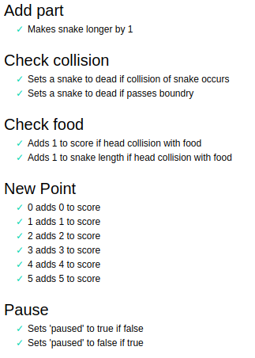

# Snake

Snake Game built in p5 for JavaScript  
Testing done in MochaJS and ChaiJS  

## How to Run

1 - Clone Repository  
2 - Locally host project  
3 - Open browser and go to hosted  
&emsp;Ex. localhost:8080  
4 - The game is playable from here

## How to View Tests

1 - Follow the above steps  
2 - Go to subdirectory /tests.html  
&emsp;Ex. localhost:8080/tests.html  
3 - All tests are viewable from this interface  
4 - See below the screen that should be viewed  
   

  
5 - Each test can be individually clicked on as well to view the code involved

## Software Process and Technologies

The software process used was agile with intermittent white box and static analysis done throughout the development process as to ensure flexibility with changing requirements. More vigourous unit testing near the end of the development process.  
Technologies chosen were p5 for graphics in JavaScript as well as MochaJS for testing suite and Chai for assertions. This combonations of technologies allowed for an overall coverage of the development process.